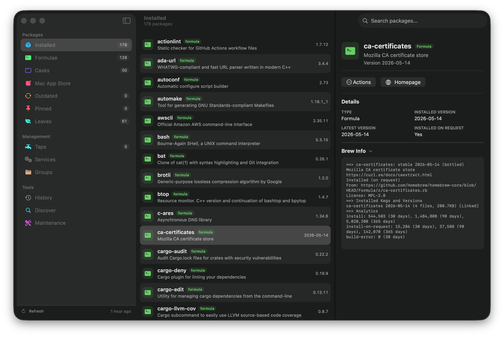

# Brewy

<!-- fleet:block badges -->

[](https://github.com/starhaven-io/Brewy/actions/workflows/ci.yml)
[](LICENSE)

<!-- fleet:end -->

<p align="center"></p>

Brewy is a native macOS app for managing [Homebrew](https://brew.sh) packages, casks, taps, services, and maintenance tasks without dropping into Terminal.

It is designed for people who already use Homebrew and want a fast, inspectable Mac interface for the work they do repeatedly: reviewing what is installed, upgrading safely, cleaning up old dependencies, and understanding why a package is on the machine.

<p align="center"></p>

## Highlights

- Browse installed formulae, casks, Mac App Store apps, pinned packages, leaves, and outdated packages.
- Search Homebrew formulae and casks from the Discover view, then install directly from the result list.
- Inspect package details, versions, dependencies, reverse dependencies, and recursive dependency trees.
- Install, uninstall, upgrade, reinstall, fetch, pin, unpin, link, and unlink packages through native macOS controls.
- Upgrade all outdated Homebrew packages at once, or select exactly which packages to upgrade.
- Manage Homebrew services, including start, stop, restart, stale-service cleanup, and optional sudo actions.
- Manage taps, with health checks for archived, moved, or missing GitHub repositories.
- Group packages into custom collections for projects, roles, or cleanup work.
- Review action history and retry failed commands when it is safe to do so.
- Run `brew doctor`, update Homebrew, remove orphaned packages, and clear caches with dry-run previews for destructive maintenance.
- Use the menu bar extra to see the current outdated count and trigger quick refresh or upgrade actions.
- Choose light, dark, or system appearance, configure the `brew` path, and set an auto-refresh interval.
- Receive app updates through Sparkle.

## Requirements

- macOS 15.0 or later on Apple Silicon.
- [Homebrew](https://brew.sh) installed. Brewy defaults to `/opt/homebrew/bin/brew`, and the path is configurable in Settings.
- [`mas`](https://github.com/mas-cli/mas) is optional. Brewy uses it for the Mac App Store view and can install it through Homebrew.

## Installation

The best way to install Brewy is naturally with Homebrew. It's in [homebrew-cask](https://github.com/Homebrew/homebrew-cask):

```sh
brew install brewy
```

Or install it from the [starhaven-io tap](https://github.com/starhaven-io/homebrew-tap):

```sh
brew install starhaven-io/tap/brewy
```

You can also grab the latest release from the [GitHub releases page](https://github.com/starhaven-io/Brewy/releases).

## Building

1. Clone the repository
2. Open `Brewy.xcodeproj` in Xcode
3. Build and run with Command-R

For local verification, install the optional tools listed in [CONTRIBUTING.md](CONTRIBUTING.md) and run:

```sh
just check
```

Run `just lychee` after changing README or CONTRIBUTING links.

## Security model

Brewy is intentionally not sandboxed. It needs to execute the user's Homebrew installation and manage packages, casks, taps, services, and local caches on the machine.

All CLI execution is centralized through `CommandRunner`, which invokes binaries with argument arrays rather than shell strings. Package names, tap names, appcast data, and other external metadata are treated as untrusted.

Destructive maintenance operations show Homebrew dry-run previews before they can run. External links from package data, tap data, and release notes must pass through `ExternalURLPolicy`, which restricts URLs to `http` and `https` before opening them outside the app.

Brewfiles are treated as code, because `brew bundle` executes the Ruby they contain. Brewy never runs a Brewfile until you explicitly trust it in the Bundle view, and it pins a SHA-256 digest of the trusted file: if the file changes on disk for any reason, every bundle operation stops until you review and re-trust it.

Report suspected vulnerabilities privately by emailing [security@starhaven.io](mailto:security@starhaven.io) or using [GitHub's private vulnerability reporting](https://github.com/starhaven-io/Brewy/security/advisories/new). See the [security policy](SECURITY.md) for details.

## Contributing

Contributions are welcome. See [CONTRIBUTING.md](CONTRIBUTING.md) for the development setup, local checks, and commit conventions.

## Acknowledgements

Thanks to [@bevanjkay](https://github.com/bevanjkay) for the classic app icon idea.

<!-- fleet:block license-section -->

## License

This project is licensed under the [GNU Affero General Public License v3.0](LICENSE) (`AGPL-3.0-only`).

Copyright (C) 2026 Patrick Linnane

<!-- fleet:end -->
